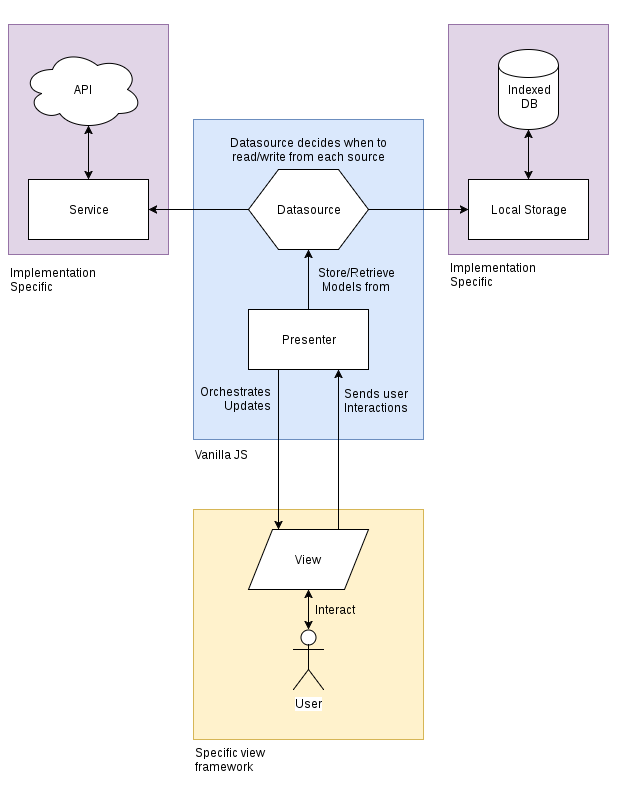

# IWatchNow - Development Information

## Description

Interaction Programming Project DD1389. Movie service with unique features including infinite scroll, quiz generator, chat functionality. Hosted on Heroku.

## To Get Started

Run the following command in root directory:

```javascript
npm i
```

## Available Scripts

### `npm run start`

Runs the app in the development mode.\
Open [http://localhost:3000](http://localhost:3000) to view it in the browser.

The page will reload if you make edits.

### `npm run test`

Launches the test runner in the interactive watch mode.

### `npm run build`

Builds the app for production to the `build` folder.\
The app is then ready to be deployed!

See the section about [deployment](https://facebook.github.io/create-react-app/docs/deployment) for more information.

## Screenshots


